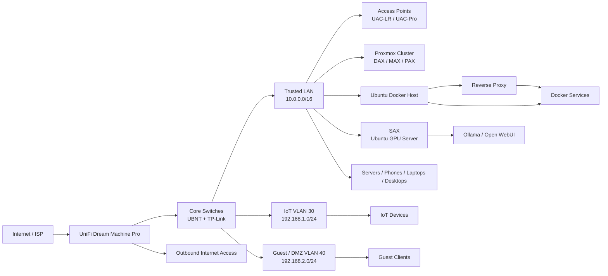

# WoogleNet Home Lab Infrastructure

This repository documents the architecture, hardware, services, and deployment plan for the WoogleNet home lab and network environment. The goal is to create a clear, maintainable, and secure internal network that separates management, production services, personal devices, IoT, and guest traffic.

## Overview

WoogleNet is designed as a home-lab style network with a layered security model:

- Production services remain on a controlled internal network
- IoT traffic is isolated and limited to internet access only
- Guest traffic is segmented into a separate DMZ-style network
- Core infrastructure is centralized around a gateway, VLAN-aware switching, and wireless access points

This document acts as the base operating reference for the environment and will evolve as the infrastructure matures.

---

## Architecture Summary

### Current State

- Primary network: 10.0.0.1 / 255.255.0.0
- Wireless access currently segmented into isolated SSIDs
- Target design keeps the trusted LAN interconnected and uses VLANs to isolate IoT and Guest traffic

### Target Network Segmentation

| Network | VLAN | Subnet | Access | Security Model |
|---|---:|---|---|---|
| Trusted LAN (management, servers, personal) | Native / untagged | 10.0.0.0/16 | DHCP reservations and DHCP | Interconnected; restrict management services at the host/application layer |
| IoT | 30 | 192.168.1.0/24 | DHCP | Internet access; deny initiation to trusted and Guest networks |
| IoT | 30 | 192.168.1.0/24 | DHCP | Internet access; allow DNS to AdGuard only; deny other trusted/Guest access |
| Guest / DMZ | 40 | 192.168.2.0/24 | DHCP | Internet-only; DNS exception to selected resolver; deny other private-network access |

### Wireless Mapping

- WoogleNet → Trusted LAN (native / untagged)
- WoogleNetIOT → VLAN 30, 192.168.1.0/24
- WoogleNetGuest → VLAN 40, 192.168.2.0/24

---

## Technical Architecture Diagram



This diagram represents one interconnected trusted LAN, with IoT and Guest/DMZ separated by VLANs and firewall policy. The NAS platform and export are not selected yet.

---

## Hardware Inventory

### Network Equipment

| Device | Model | Quantity | Purpose |
|---|---|---:|---|
| Gateway | UniFi Dream Machine Pro (UDM-Pro) | 1 | Primary internet edge, routing, and VLAN gateway |
| Core / Distribution Switch | UBNT 24 Port | 2 | Internal VLAN distribution |
| Access / Edge Switch | TP-Link 24 Port | 2 | Client and AP uplinks |
| Access Point | UAC-LR | 3 | General coverage |
| Access Point | UAC-Pro | 3 | High-density areas |
| Access Point | UAC External | 1 | Outdoor coverage |

### Compute Equipment

| Hardware | Operating System | Quantity | Role |
|---|---|---:|---|
| Dell R720 | Proxmox VE | 3 | Hypervisor cluster: DAX, MAX, PAX |
| JAX | Ubuntu Server (bare metal) | 1 | Non-GPU Docker host for foundation, data, and media stacks |
| SAX | Ubuntu Server (bare metal) | 1 | New GPU host for Ollama and GPU-enabled containers |
| NAS | Not selected | TBD | NFS data root is deferred until storage is provisioned |

### Rack Layout (42U)

| Rack Unit | Component | Name / Notes |
|---|---|---|
| U1 | Router / Gateway | WoogleNetRouter_R01 |
| U2 | Patch Panel | --- |
| U3 | Switch | WoogleNetSwitch01 |
| U4 | Patch Panel | --- |
| U5 | Switch | WoogleNetSwitch02 |
| U6 | Patch Panel | --- |
| U7 | Switch | WoogleNetSwitch03 |
| U8 | Patch Panel | --- |
| U12 | Monitor | System console |
| U16 | Shelf | Keyboard / mouse |
| U21 | Shelf | Accessories |
| U23 | KVM | Management console |
| U24-U25 | Server | DAX |
| U26-U27 | Server | MAX |
| U28-U29 | Server | JAX |
| U30-U31 | Server | PAX |
| U32-U39 | UPS | Power redundancy |

---

## Service Inventory

### Core Services

| Service Category | Service / Role | Host / Platform | Network | Notes |
|---|---|---|---|---|
| Infrastructure | Proxmox VE | DAX, MAX, PAX | Trusted LAN | Three-node R720 cluster; NAS platform remains undecided |
| Proxy | Nginx Proxy Manager | JAX / Docker | Trusted LAN | Publish selected services only; admin interface stays private |
| DNS Filtering | AdGuard Home | JAX / Docker | Trusted LAN | Internal DNS and filtering; migrate DHCP DNS only after testing |
| Remote Access | Tailscale | JAX and SAX / host | Trusted LAN | Private administration and remote access |
| AI | Ollama, Open WebUI | SAX / Ubuntu bare metal | Trusted LAN | Model API and web interface using local GPUs |
| Knowledge Base | BookStack | JAX / Docker | Trusted LAN | Documentation and future RAG source |
| Files and Documents | Nextcloud, Paperless-ngx | JAX / Docker | Trusted LAN | File sync and document archive |
| Password Manager | Vaultwarden | JAX / Docker | Trusted LAN | Restrict to trusted/VPN paths and back up securely |
| Media | Plex, Jellyfin, Sonarr, Radarr, Prowlarr | JAX / Docker | Trusted LAN | Media playback and automation; shared data root required for hardlinks |
| Media Utilities | Tdarr, TMM, download client | JAX / Docker | Trusted LAN | Transcoding, metadata, and downloads; select a download client before Sprint 4 |
| Personal Libraries | Immich, Audiobookshelf, Calibre, Navidrome | JAX / Docker | Trusted LAN | Photos, audiobooks, ebooks, and music |
| Sync and Gaming | Syncthing, RomM | JAX / Docker | Trusted LAN | File synchronization and game library management |
| Smart Home | Home Assistant | Dedicated host / VM | Trusted LAN with IoT rules | AI integration; restrict exposed entities and firewall flows |
| Operations | Homepage, Uptime Kuma | Docker host | Trusted LAN | Dashboard and monitoring |

### Naming Convention

| Category | Convention | Example |
|---|---|---|
| Server | 3-letter uppercase | DAX, MAX, JAX, PAX, SAX |
| Container | [Server Name][App] | DAXPlex, MAXImmich |
| Network device | WoogleNet[Function][ID/Model] | WoogleNetRouter, WoogleNetSwitch01 |
| Access point | [Location] | UPSTAIRS, DOWNSTAIRS, MAIN |
| Personal device | [Owner]_[Device]_[Model] | Eric_Phone_Pixel9 |
| IoT device | [Location]_[Function]_[Num] | Office_Light_1 |

---

## Docker on Ubuntu Setup

The platform uses Docker Engine and Docker Compose to make application deployment consistent and portable.

### Installation Steps

1. Update existing system packages
2. Install prerequisite packages for HTTPS-based package repositories
3. Import the official Docker GPG key
4. Configure the Docker APT repository
5. Install Docker Engine, CLI, and Compose plugins
6. Add the current user to the docker group

### Bootstrap Scripts

The scripts bootstrap JAX and SAX, install Docker and Tailscale, and provide a Compose lifecycle helper. Review configuration and keep local console access before network changes:

- [setup_network.sh](setup_network.sh): configure JAX (`10.0.2.10/16`) or SAX (`10.0.2.11/16`) on the trusted LAN via `WOOGLENET_*` overrides; optional NFS is disabled until a NAS export exists. Reserve both addresses in UDM-Pro DHCP and set each real NIC name before running.
- [Docker Installation Script for Ubunt.sh](Docker%20Installation%20Script%20for%20Ubunt.sh): install Docker Engine and Compose on Ubuntu. Run with `sudo` from the intended non-root login account; membership in the `docker` group grants root-equivalent access.
- [scripts/install-tailscale.sh](scripts/install-tailscale.sh): install and enable the native Tailscale daemon; authorize separately with `sudo tailscale up`.
- [scripts/compose-stack.sh](scripts/compose-stack.sh): validate and operate Compose projects; `down` preserves named volumes.
- [scripts/compose-stack.sh](scripts/compose-stack.sh): validate and operate Compose projects; `down` preserves named volumes.
- [stacks/foundation/compose.yaml](stacks/foundation/compose.yaml): pinned AdGuard Home and Nginx Proxy Manager stack for JAX.
- [stacks/ai/compose.yaml](stacks/ai/compose.yaml): GPU-isolated Ollama endpoints and Open WebUI stack for SAX.

Example from the repository root; run the matching command locally on each host and replace its interface name:

```bash
# On JAX:
sudo env WOOGLENET_HOSTNAME=jax WOOGLENET_INTERFACE=enpXsY WOOGLENET_STATIC_IP=10.0.2.10/16 ./setup_network.sh
sudo ./"Docker Installation Script for Ubunt.sh"
# On SAX:
sudo env WOOGLENET_HOSTNAME=sax WOOGLENET_INTERFACE=enpXsY WOOGLENET_STATIC_IP=10.0.2.11/16 ./setup_network.sh
sudo ./"Docker Installation Script for Ubunt.sh"
sudo bash scripts/install-tailscale.sh
sudo tailscale up
# On JAX:
cp stacks/foundation/.env.example stacks/foundation/.env
bash scripts/compose-stack.sh validate stacks/foundation
bash scripts/compose-stack.sh up stacks/foundation
# On SAX, fill the Tailnet IP and GPU UUIDs in stacks/ai/.env first:
cp stacks/ai/.env.example stacks/ai/.env
bash scripts/compose-stack.sh validate stacks/ai
bash scripts/compose-stack.sh up stacks/ai
```

The foundation stack runs on JAX at `10.0.2.10`; DNS and NPM HTTP/HTTPS bind to that reserved LAN IP, and setup/admin ports bind to loopback. Do not configure WAN port forwards or advertise AdGuard via DHCP until Sprint 1 verification passes. Run `setup_network.sh` from each host's local console; it does not configure UniFi VLANs or firewall rules.

---

## DNS and Resolution

### Local DNS

The gateway provides routing and DHCP. AdGuard Home is the planned internal DNS/filtering service; switch DHCP-advertised DNS to AdGuard only after local and external lookups, fallback behavior, and recovery access have been tested.

### Recommended External DNS Providers

| Provider | Primary | Secondary | Notes |
|---|---|---|---|
| Cloudflare | 1.1.1.1 | 1.0.0.1 | Very fast and privacy-friendly |
| Google | 8.8.8.8 | 8.8.4.4 | Stable and globally available |
| Quad9 | 9.9.9.9 | 149.112.112.112 | Security-conscious |
| AdGuard | 94.140.14.14 | 94.140.15.15 | DNS ad filtering |

---

## Deployment Plan

The implementation roadmap is maintained in [SPRINT-PLAN.md](SPRINT-PLAN.md). It expands the requested Sprints 0-5 into prerequisites, run steps, and acceptance checks. Complete and verify each sprint before exposing the next set of services.

The existing [Network upgrade.docx](Network%20upgrade.docx) contains an earlier VLAN/IP proposal and an embedded Ubuntu script. The confirmed target is documented here and in the sprint plan; do not run the embedded script or apply its obsolete `192.168.20.0/24` settings.

---

## Operational Notes

This repository is intended to serve as a practical, evolving reference for the WoogleNet environment. It captures the current state, target design, and deployment approach while remaining flexible enough to accommodate additional services, documentation, and operational improvements over time.

Use this project as a foundation for:

- network planning and changes
- hardware tracking
- service naming consistency
- deployment verification
- future home-lab expansion

---

## Purpose Statement

The WoogleNet infrastructure exists to provide a secure and organized home lab that balances convenience, performance, privacy, and network isolation. The environment is intentionally structured so that internal services can remain stable while guest and IoT traffic are kept segregated from production workloads.

