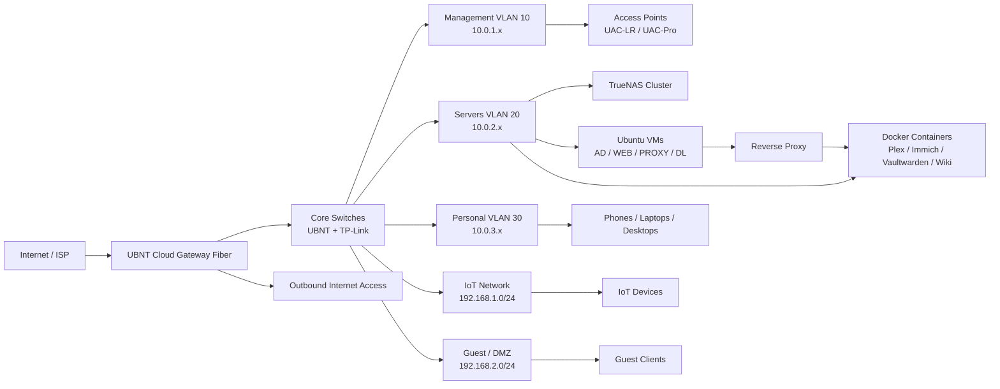

# WoogleNet Home Lab Infrastructure

This repository documents the architecture, hardware, services, and deployment plan for the WoogleNet home lab and network environment. The goal is to create a clear, maintainable, and secure internal network that separates management, production services, personal devices, IoT, and guest traffic.

## Overview

WoogleNet is designed as a home-lab style network with a layered security model:

- Production services remain on a controlled internal network
- IoT traffic is isolated and limited to internet access only
- Guest traffic is segmented into a separate DMZ-style network
- Core infrastructure is centralized around a gateway, VLAN-aware switching, and wireless access points

This document acts as the base operating reference for the environment and will evolve as the infrastructure matures.

---

## Architecture Summary

### Current State

- Primary network: 10.0.0.1 / 255.255.0.0
- Wireless access currently segmented into isolated SSIDs
- Target design is a VLAN-based production network with managed routing, control planes, and service isolation

### Target Network Segmentation

| Network | VLAN | Subnet | Access | Security Model |
|---|---:|---|---|---|
| Production / Management | 10 | 10.0.1.x | Static | Internal routing allowed |
| Production / Servers | 20 | 10.0.2.x | Static / mixed | Internal services |
| Personal Devices | 30 | 10.0.3.x | DHCP | Internal access allowed |
| IoT | N/A | 192.168.1.0/24 | DHCP | Internet-only, no access to internal networks |
| Guest / DMZ | N/A | 192.168.2.0/24 | DHCP | Internet-only |

### Wireless Mapping

- WoogleNet → VLAN 30
- WoogleNetIOT → 192.168.1.0/24
- WoogleNetGuest → 192.168.2.0/24

---

## Technical Architecture Diagram



This diagram represents the target architecture: a gateway-based border router with traffic segregation at the switch and wireless layers.

---

## Hardware Inventory

### Network Equipment

| Device | Model | Quantity | Purpose |
|---|---|---:|---|
| Gateway | UBNT Cloud Gateway Fiber (UCG-Fiber) | 1 | Primary internet edge and routing |
| Core / Distribution Switch | UBNT 24 Port | 2 | Internal VLAN distribution |
| Access / Edge Switch | TP-Link 24 Port | 2 | Client and AP uplinks |
| Access Point | UAC-LR | 3 | General coverage |
| Access Point | UAC-Pro | 3 | High-density areas |
| Access Point | UAC External | 1 | Outdoor coverage |

### Compute Equipment

| Hardware | Operating System | Quantity | Role |
|---|---|---:|---|
| Dell R720 | TrueNAS | 4 | Storage / hypervisor platform |
| Ubuntu Server VM Host | Ubuntu Server | Variable | Docker and VM runtime environment |

### Rack Layout (42U)

| Rack Unit | Component | Name / Notes |
|---|---|---|
| U1 | Router / Gateway | WoogleNetRouter_R01 |
| U2 | Patch Panel | --- |
| U3 | Switch | WoogleNetSwitch01 |
| U4 | Patch Panel | --- |
| U5 | Switch | WoogleNetSwitch02 |
| U6 | Patch Panel | --- |
| U7 | Switch | WoogleNetSwitch03 |
| U8 | Patch Panel | --- |
| U12 | Monitor | System console |
| U16 | Shelf | Keyboard / mouse |
| U21 | Shelf | Accessories |
| U23 | KVM | Management console |
| U24-U25 | Server | DAX |
| U26-U27 | Server | MAX |
| U28-U29 | Server | JAX |
| U30-U31 | Server | PAX |
| U32-U39 | UPS | Power redundancy |

---

## Service Inventory

### Core Services

| Service Category | Service / Role | Host / Platform | Network | Notes |
|---|---|---|---|---|
| Infrastructure | TrueNAS | Dell R720 cluster | 10.0.2.x | Storage and virtualization foundation |
| Identity | Active Directory / Domain Controller | Ubuntu VM | 10.0.2.x | Centralized access and auth |
| Proxy | Reverse Proxy | Ubuntu VM | 10.0.2.x | Frontend entry point |
| Web | Web Server | Ubuntu VM | 10.0.2.x | Hosted web applications |
| Downloads | Download Manager | Ubuntu VM | 10.0.2.x | Media and transfer workloads |
| Media | Plex | Container | 10.0.2.x | Streaming service |
| Automation | Tdarr / TMM | Container | 10.0.2.x | Media processing workflows |
| Personal Apps | Immich | Container | 10.0.2.x | Photo library |
| Password Manager | Vaultwarden | Container | 10.0.2.x | Self-hosted credential storage |
| Documentation | Wiki | Container | 10.0.2.x | Internal knowledge base |
| E-book Library | Calibre | Container | 10.0.2.x | Book management |
| DNS Filtering | AdGuard Home | Container / VM | 10.0.2.x | Internal DNS and filtering; configure clients only after testing resolution |
| AI | Ollama, Open WebUI | GPU-enabled Ubuntu VM | 10.0.2.x | Model API and web interface |
| Knowledge Base | BookStack | Container | 10.0.2.x | Documentation and future RAG source |
| Files and Documents | Nextcloud, Paperless-ngx | Containers | 10.0.2.x | File sync and document archive |
| Media | Plex, Jellyfin, Sonarr, Radarr, Prowlarr | Containers | 10.0.2.x | Media playback and automation |
| Media Utilities | Tdarr, TMM, download client | Containers | 10.0.2.x | Transcoding, metadata, and downloads; select a download client before Sprint 4 |
| Personal Libraries | Immich, Audiobookshelf, Calibre, Navidrome | Containers | 10.0.2.x | Photos, audiobooks, ebooks, and music |
| Sync and Gaming | RomM | Containers | 10.0.2.x | Game library management |
| Smart Home | Home Assistant | VM / dedicated host | IoT / trusted networks | AI integration; restrict exposed entities |
| Operations | Homepage, Uptime Kuma, Syncthing | Containers | 10.0.2.x | Dashboard, monitoring, and file sync |

### Naming Convention

| Category | Convention | Example |
|---|---|---|
| Server | 3-letter uppercase | DAX, MAX, JAX, PAX |
| Container | [Server Name][App] | DAXPlex, MAXImmich |
| Network device | WoogleNet[Function][ID/Model] | WoogleNetRouter, WoogleNetSwitch01 |
| Access point | [Location] | UPSTAIRS, DOWNSTAIRS, MAIN |
| Personal device | [Owner]_[Device]_[Model] | Eric_Phone_Pixel9 |
| IoT device | [Location]_[Function]_[Num] | Office_Light_1 |

---

## Docker on Ubuntu Setup

The platform uses Docker Engine and Docker Compose to make application deployment consistent and portable.

### Installation Steps

1. Update existing system packages
2. Install prerequisite packages for HTTPS-based package repositories
3. Import the official Docker GPG key
4. Configure the Docker APT repository
5. Install Docker Engine, CLI, and Compose plugins
6. Add the current user to the docker group

### Bootstrap Scripts

The repository scripts are the starting point for Ubuntu VM provisioning and Docker installation. Review the configuration values and have console access before applying network changes:

- [setup_network.sh](setup_network.sh): set the Ubuntu VM hostname and static address; optionally configure one NFS data-root mount. The example address follows the documented `10.0.2.0/24` server network and must be checked against the final gateway/DHCP plan.
- [Docker Installation Script for Ubunt.sh](Docker%20Installation%20Script%20for%20Ubunt.sh): install Docker Engine and Compose on Ubuntu. Run with `sudo` from the intended non-root login account; the account joins the privileged `docker` group.

Example:

```bash
chmod 750 setup_network.sh "Docker Installation Script for Ubunt.sh"
sudo ./setup_network.sh
sudo ./"Docker Installation Script for Ubunt.sh"
```

The network script uses `netplan try` so an unconfirmed change rolls back. Run it from the VM console or another out-of-band session, not over the only SSH connection. It does not configure UniFi VLANs or firewall rules.

---

## DNS and Resolution

### Local DNS

The gateway provides routing and DHCP. AdGuard Home is the planned internal DNS/filtering service; switch DHCP-advertised DNS to AdGuard only after local and external lookups, fallback behavior, and recovery access have been tested.

### Recommended External DNS Providers

| Provider | Primary | Secondary | Notes |
|---|---|---|---|
| Cloudflare | 1.1.1.1 | 1.0.0.1 | Very fast and privacy-friendly |
| Google | 8.8.8.8 | 8.8.4.4 | Stable and globally available |
| Quad9 | 9.9.9.9 | 149.112.112.112 | Security-conscious |
| AdGuard | 94.140.14.14 | 94.140.15.15 | DNS ad filtering |

---

## Deployment Plan

The implementation roadmap is maintained in [SPRINT-PLAN.md](SPRINT-PLAN.md). It expands the requested Sprints 0-5 into prerequisites, run steps, and acceptance checks. Complete and verify each sprint before exposing the next set of services.

The existing [Network upgrade.docx](Network%20upgrade.docx) contains an earlier UDM-Pro/Proxmox/`192.168.20.0/24` design. It conflicts with this README's UCG-Fiber/TrueNAS/`10.0.2.0/24` target; do not run its embedded script or apply its VLAN instructions until the topology and addressing decision is reconciled. The sprint plan documents the current working assumptions and the decisions still required.

---

## Operational Notes

This repository is intended to serve as a practical, evolving reference for the WoogleNet environment. It captures the current state, target design, and deployment approach while remaining flexible enough to accommodate additional services, documentation, and operational improvements over time.

Use this project as a foundation for:

- network planning and changes
- hardware tracking
- service naming consistency
- deployment verification
- future home-lab expansion

---

## Purpose Statement

The WoogleNet infrastructure exists to provide a secure and organized home lab that balances convenience, performance, privacy, and network isolation. The environment is intentionally structured so that internal services can remain stable while guest and IoT traffic are kept segregated from production workloads.

